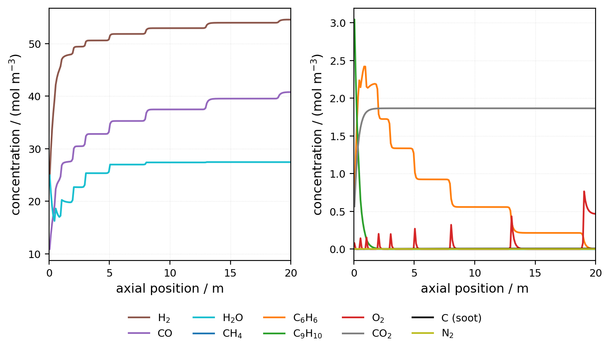
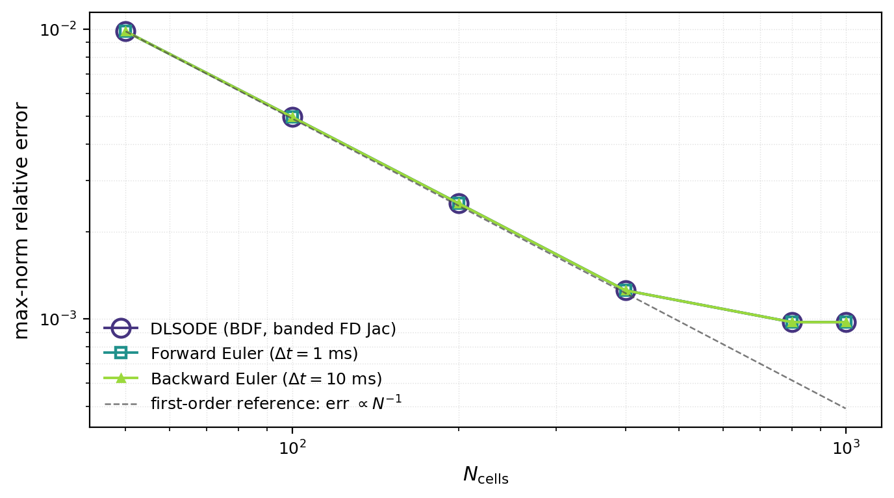

# Dynamic Simulation of a Tubular Chemical Reactor

**Fortran 2018 finite-volume solver + Python experiment pipeline for a stiff system of 2,000 coupled differential equations**

[](https://github.com/OB-1997/pfr-reactor-simulation/actions/workflows/ci.yml)


Bachelor thesis project — *Dynamic Modelling of Tubular Reactor for Conversion of Pyrolytic Gas*, University of Chemistry and Technology, Prague — defended June 2026. 📄 [Full thesis (PDF)](thesis/main.pdf) · 🎤 [Defense slides (PDF, in Czech)](thesis/defense_presentation.pdf)

---

## What this is

Pyrolysis — thermal decomposition of plastic and organic waste — produces a messy gas: methane, light hydrocarbons, tar (heavy polycyclic aromatics), and little of value directly. Passing it through a high-temperature tubular reactor with staged injections of oxygen and steam upgrades it into **hydrogen-rich synthesis gas** (CO + H₂), the feedstock for synthetic fuels via Fischer–Tropsch synthesis. Industrial units doing exactly this are being built today; designing and operating them well requires a simulator.

A chemical reactor is, mathematically, a **partial differential equation**: concentrations change along the reactor's length (flow, diffusion) and over time (reactions). This project builds such a simulator entirely from scratch — no simulation packages, just the numerical method implemented directly.

The pipeline from physics to result:

1. **Model** — a 20 m × 0.6 m tube at 1173 K. 10 chemical species and 8 global reactions with exponential (Arrhenius) temperature dependence, each rate law sourced from the combustion/reforming literature; tar is represented by the kinetic surrogate α-methylstyrene. Nine side-injectors deliver O₂ and steam at fixed axial positions (0–19 m), staging partial oxidation and steam reforming along the tube. Governing equations: 1-D convection–diffusion–reaction PDEs.
2. **Discretise** — the finite volume method (first-order upwind convection, central diffusion) turns the PDE into a system of **10 species × 200 grid cells = 2,000 coupled ordinary differential equations**. Because FVM balances fluxes across cell faces, mass is conserved exactly by construction. The system is *stiff*: dynamics span milliseconds (oxidation at the injector cells) to tens of seconds (residence time τ ≈ 39 s), which is exactly what makes it numerically interesting.
3. **Integrate** — three solvers, implemented and benchmarked head-to-head:
   - **forward Euler** (explicit, simple, time step bounded by stability at Δt = 1 ms),
   - **backward Euler** with a Newton iteration solving a banded Jacobian system each step (implicit, unconditionally stable — buys arbitrarily large steps at the price of a nonlinear solve per step),
   - **DLSODE** from ODEPACK (adaptive step *and* order, BDF 1–5 — the production-grade reference).
4. **Verify & explore** — convergence studies against a closed-form analytical solution, wall-clock benchmarking, and parametric sweeps over temperature, feed velocity, and injection flow rate.

Simulated steady-state concentration profiles along the reactor (each step is a side-injection point):



The model resolves three distinct reaction zones: a sharp partial-oxidation front in the first half-metre, a "staircase" steam-reforming zone driven by the injectors (0.5–13 m), and a near-complete-conversion outlet zone delivering syngas at H₂/CO ≈ 1.34.

## Highlights

**Numerical methods**
- Finite-volume discretisation of a convection–diffusion–reaction PDE (method of lines)
- Explicit vs implicit time integration on a genuinely stiff system, including a hand-written Newton solver with banded LU factorisation
- **Verification against an analytical solution**: a companion project swaps the 8-reaction chemistry for a single reaction with a known closed-form solution, isolating pure discretisation error. All three solvers reproduce the theoretical first-order convergence rate until they hit the accuracy floor:



**Software engineering**
- ~1,700 lines of modular Fortran 2018 (parameters / model / solvers / I/O / CLI as separate modules), compiled with `-Wall -Wextra -fcheck=all`
- Runtime configuration via namelist files — every experiment is a config file, not a code edit
- **Full reproducibility**: each thesis figure maps to one Python orchestrator (runs the simulations) + one plot script; every figure in the results chapter can be regenerated with two commands
- Programmatic validation suite (`validate.py`): mass conservation, steady-state detection, and error bounds against two independent analytical references
- CI: both solvers build and run a smoke simulation on every push

## Repository map

| Path | What it is |
|---|---|
| [`code/isothermal_model/`](code/isothermal_model/) | The main simulator: Fortran solver + Python experiment pipeline. Its README is a complete user manual. |
| [`code/simple_pfr_analytical_test/`](code/simple_pfr_analytical_test/) | Verification benchmark against a closed-form analytical solution (same solver code, simplified chemistry). |
| [`code/fvm_python_prototype/`](code/fvm_python_prototype/) | The finite-volume method in ~200 lines of NumPy — the accessible entry point to the numerics. |
| [`thesis/`](thesis/) | LaTeX source and the compiled [thesis PDF](thesis/main.pdf). |

## Quickstart

Requires `gfortran`, `make`, and Python 3 with NumPy + Matplotlib (per-platform install commands in the [model README](code/isothermal_model/README.md)).

```bash
cd code/isothermal_model
make                            # build the Fortran binary
python3 runs/base_case.py       # simulate the design operating point
python3 plots/base_case.py      # -> results/[base_case]/profiles.png
```

Or the 200-line Python version, no compiler needed:

```bash
python3 code/fvm_python_prototype/main.py
```

## Selected results

**Numerical findings** (thesis §4.3–4.5)

- **Solver choice is problem-dependent, and measurably so.** At N = 400 cells the wall-clock times are: forward Euler **2.6 s**, backward Euler **8.2 s**, DLSODE **28.6 s** — the "smartest" integrator is 10× slower than the simplest one, because forward Euler's cheap steps beat adaptive machinery until the grid gets fine. With a *tuned* step (Δt = 100 ms), backward Euler flips the ranking and runs **2.7× faster** than forward Euler; the explicit/implicit crossover sits at Δt ≈ 25–50 ms, independent of grid size.
- **Adaptive solvers can fail non-obviously.** DLSODE's cost scales non-monotonically with grid size: at N = 800 its BDF order collapses to 1 and it takes 22,856 internal steps — an anomaly a benchmark-driven workflow catches and a "just trust the library" workflow doesn't.
- **All solvers converge at the theoretical first-order rate** on the analytical benchmark, agreeing to 4 significant digits, confirming the dominant error is spatial discretisation, not time integration (§4.4).
- **A numerical artefact, caught and diagnosed**: at low feed velocity the product profiles appeared to collapse near the outlet. The cause was not physics but an insufficient integration horizon (t_end = 1 residence time); re-running at 5τ removed it. Distinguishing artefact from signal is the same skill whether the pipeline is a PDE solver or a data analysis.

**Engineering findings** (§4.2) — three control levers, one optimum

- **Injection flow rate (F)** is the only lever with a non-monotonic optimum in the tested range: at 0.5× nominal, tar slips through unconverted; at 1.5×, the system saturates and H₂ yield marginally drops.
- **Temperature** acts as a threshold: below ~1173 K tar escapes the reactor; 100 K hotter, soot formation grows by two orders of magnitude and CO₂ quadruples.
- **Feed velocity** trades throughput against residence time — too fast and the tar doesn't finish reforming.

## Scope and limitations

Stated openly, because knowing a model's validity envelope is part of the modelling:

- **Isothermal** — temperature is a fixed parameter, not a state variable; there is no energy balance. This is the model's main simplification and its natural next extension: T(x, t) as an eleventh state field.
- **Lumped kinetics** — 8 global reactions with a single tar surrogate stand in for full PAH chemistry; multi-component tar models (e.g. Salem 2019) are the upgrade path.
- **1-D** — radial gradients are neglected, an assumption that is least safe near the injection points.
- **Verified, not validated** — the code is checked against analytical solutions and internal consistency (mass conservation, grid convergence), but not yet against pilot-plant measurements.

## Why this project (a note for the ML/DS-minded reader)

This is the same toolbox that underlies modern scientific machine learning: systems of ODEs and their integrators (neural ODEs), discretising PDEs on grids (physics-informed networks, simulation surrogates), stiffness and conditioning, convergence analysis, and the discipline of validating numerical code against known ground truth. The project demonstrates that toolbox end-to-end — model derivation, implementation in a compiled language, verification, benchmarking, and automated, reproducible experiments.

## For students building on this work

This repository is the archived, defended state of the thesis — it is not under active development, but it is designed to be built upon. If you are considering a follow-up project under doc. Zubov's supervision:

- **Fork the repository** and work in your own copy; the per-project READMEs in [`code/`](code/) are written as complete user manuals, and every thesis figure is reproducible with two commands.
- **Natural extension paths** (discussed at the defense): adding the energy balance — temperature T(x, t) as an eleventh state field — is the highest-value next step; a more detailed multi-component tar kinetic scheme is the second. The namelist-driven configuration and modular solver structure were built with these extensions in mind (see §6 of the [model README](code/isothermal_model/README.md) for what is runtime-configurable vs compile-time).
- **Before trusting a new result**, re-run the analytical benchmark in [`code/simple_pfr_analytical_test/`](code/simple_pfr_analytical_test/) — if your changes touch the solvers or discretisation, it will tell you immediately whether you broke convergence.
- **Cite this work** via the repository's [CITATION.cff](CITATION.cff) (GitHub's "Cite this repository" button), and feel free to reach out with questions via GitHub issues or the email below.

## Author

**Ivan Hromakov** — ivan.gromakov@gmail.com

Thesis supervised by doc. Ing. Alexandr Zubov, Ph.D., Department of Chemical Engineering, UCT Prague.

Code is MIT-licensed (see [LICENSE](LICENSE)); the bundled [ODEPACK](https://computing.llnl.gov/projects/odepack) solvers (`code/*/lib/`) are public-domain LLNL software.
