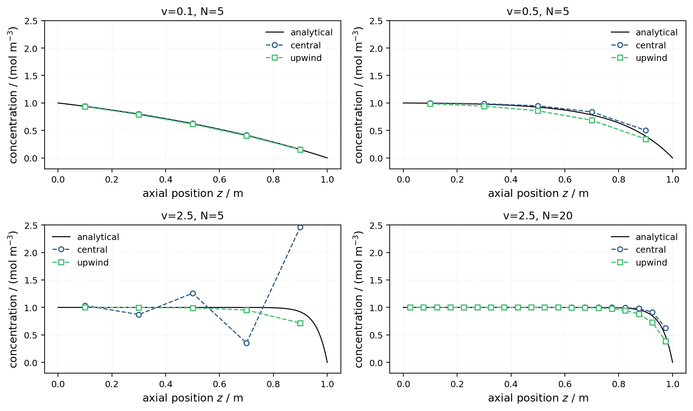

# FVM in ~200 lines of Python

A self-contained NumPy implementation of the finite-volume method for 1-D
steady-state convection–diffusion, written as a course exercise before the
thesis work began. It is the most accessible entry point to the numerics used
in this repository: the same discretisation ideas (upwind vs central
convection schemes, tridiagonal systems, comparison against an analytical
solution) reappear — scaled up and in Fortran — in
[`../isothermal_model/`](../isothermal_model/).

```bash
python3 main.py     # solves 4 test cases, plots numerical vs analytical
```

The script demonstrates the classic failure mode of the central scheme at high
cell Péclet numbers (oscillatory, unphysical profiles) and how the upwind
scheme trades that instability for numerical diffusion — the reason the thesis
model uses first-order upwind convection.


